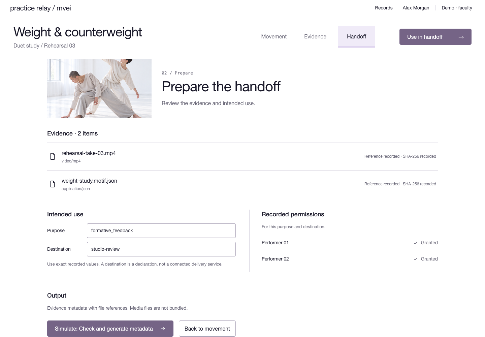
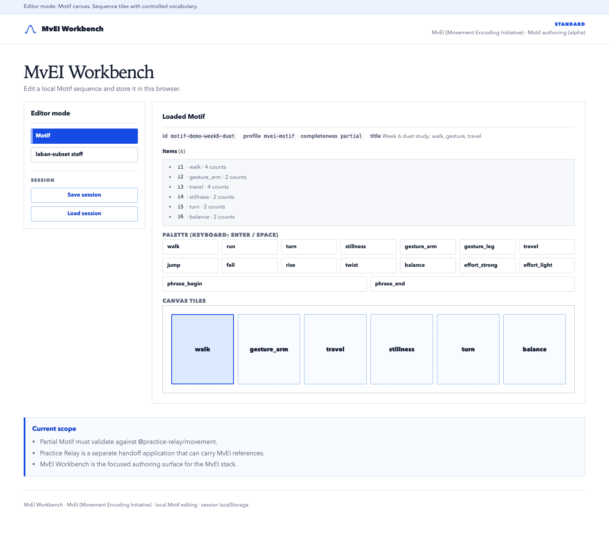
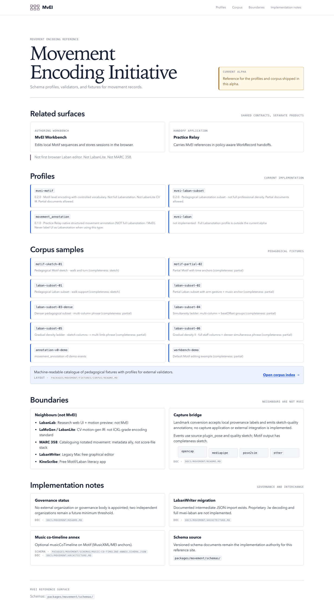

# Practice Relay

**A local-first workspace for policy-aware WorkRecord handoffs.**

Practice Relay keeps the parts of a handoff that usually scatter across systems
together: selected evidence, participants, represented subjects, permitted uses,
media and movement references, and revision history. From one record it produces
either an integrity-checked package (manifest, RO-Crate metadata, ZIP) or an
explicitly lossy interoperability projection that names what it left out.

It is not another authoring, assessment, portfolio, or repository system. Those
stay authoritative for the work itself; Practice Relay handles the transfer
between them. The monorepo also contains **MvEI** (Movement Encoding Initiative),
a separate movement-schema and authoring effort that Practice Relay can reference
without depending on.

> **Status: `0.4.0-alpha.1`.** A source candidate for local evaluation. It is not
> a production service, a published package set, a certified LMS integration, or
> a completed pilot. See [Alpha limits](docs/ALPHA.md).


## Try it

- **Interactive demo:** <https://sebastianspicker.github.io/practice-relay/>
  runs the static workspace on synthetic mock data. Its controls are simulated
  and make no API or service writes.
- **Screenshot tour:** the same site serves a static walkthrough at `/tour.html`.

## Screenshot tour

**Handoff review** — evidence, intended purpose and destination, and
participant-level permissions gathered before an export decision.



**MvEI Workbench** — local authoring for Motif and the pedagogical Laban subset,
validated against the canonical schemas.



**MvEI schema site** — the profile, vocabulary, and corpus reference for
implementers, generated from the packaged contracts.



Regenerate these with `pnpm screenshots` after interface changes. The
Pages build stages them into the tour above from `apps/relay-web/dist`.

## How it fits together

| Component | Responsibility |
| --- | --- |
| [`apps/relay-api`](apps/relay-api) | Node HTTP API: records, media, handoff export, health, local LTI |
| [`apps/relay-web`](apps/relay-web) | Static browser workspace for records, evidence, policy, and handoff readiness |
| [`apps/lti-simulator`](apps/lti-simulator) | Local LMS-shaped LTI/AGS test driver (not Canvas or Moodle) |
| [`apps/movement-workbench`](apps/movement-workbench) | MvEI Motif and Laban-subset authoring |
| [`apps/movement-schema-site`](apps/movement-schema-site) | MvEI schema, vocabulary, and corpus reference |
| [`packages/work-record`](packages/work-record) | WorkRecord aggregate, membership, time, policy, and store contracts |
| [`packages/handoff`](packages/handoff) | Package integrity, RO-Crate, ZIP, and declared-loss projections |
| [`packages/movement`](packages/movement) | MvEI schemas, vocabulary, glyphs, corpus, and browser transforms |
| [`packages/movement-toolkit`](packages/movement-toolkit) | MvEI validation, capture, import, reading, and engraving CLIs |
| `packages/{auth,lti,media-store,record-store,runtime-state,database}` | Authentication, protocol, media, and persistence adapters |

The graph runs in one direction: applications depend on packages, packages never
import applications, and the WorkRecord and movement domains stay independent.
[Architecture](docs/ARCHITECTURE.md) has the full picture.

## Quick start

Requirements: **Node.js 24 LTS** and **pnpm 9.15.0** through Corepack.

```bash
corepack enable
pnpm install --frozen-lockfile
```

Open the static workspace (no API needed; it falls back to a labelled synthetic
record):

```bash
pnpm --filter @practice-relay/relay-web dev
```

It listens on `http://127.0.0.1:5173`.

To run the API as well, use a second terminal:

```bash
pnpm --filter @practice-relay/relay-api run build
PRACTICE_RELAY_ALLOW_SYNTHETIC_AUTH=1 pnpm --filter @practice-relay/relay-api start
```

The API listens on `http://127.0.0.1:8787`. Synthetic users and development
signing material are local-only. For durable storage, configured users, object
storage, or a non-loopback listener, start with the
[operations guide](docs/relay/operations.md).

## Verification

```bash
pnpm check:all
```

`check:all` runs the deterministic lanes in order:

| Lane | Purpose |
| --- | --- |
| `pnpm check:types` | Type-check the workspace |
| `pnpm check:build` | Build the movement packages and API runtime |
| `pnpm check:packages` | Consume packed movement artifacts in isolation |
| `pnpm check:tooling` | Size, complexity, duplication, and tooling self-checks |
| `pnpm check:contracts` | Schemas, evidence wiring, and OpenAPI parity |
| `pnpm check:docs` | Repository-relative Markdown links and documented commands |
| `pnpm check:boundaries` | Package and application dependency rules |
| `pnpm check:unit` | Workspace tests |

`pnpm check:release` adds public-source hygiene. See
[Testing](docs/testing.md) for focused commands and gate ordering.

## Documentation

- [Architecture](docs/ARCHITECTURE.md) — components, dependency direction, and runtime flows
- [Product scope](PRODUCT.md) — intended users and documented limits
- [Practice Relay guide](docs/relay/README.md) — API, web workspace, storage, and lab operations
- [MvEI guide](docs/movement/README.md) — schemas, applications, and toolkit
- [Testing](docs/testing.md) and [Contributing](CONTRIBUTING.md)
- [Alpha limits](docs/ALPHA.md), [Security](SECURITY.md), and [Releasing](RELEASING.md)

## License

Apache License 2.0. See [LICENSE](LICENSE) and [NOTICE](NOTICE).
