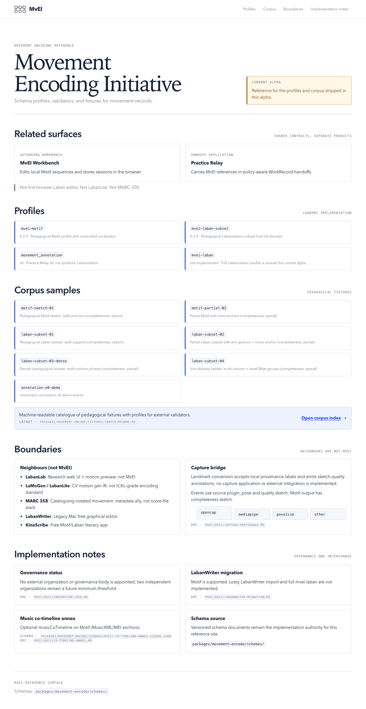
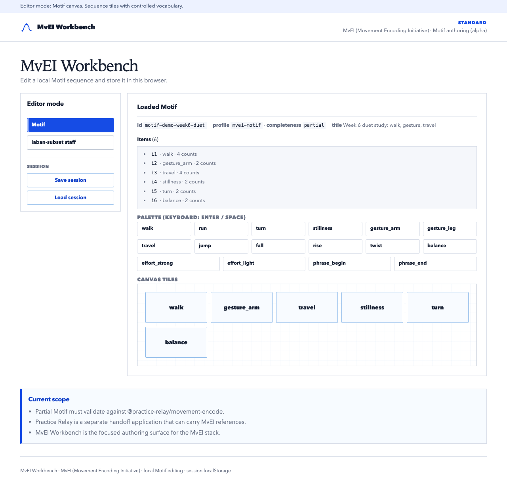

# Practice Relay public alpha

Status: local `0.4.0-alpha.1` source candidate. Git and remote publication state
are unavailable.
License: Apache-2.0 ([`LICENSE`](../LICENSE))
Candidate date: 2026-07-19

Practice Relay is a portable, versioned, policy-aware WorkRecord builder for a bounded handoff from creation to assessment to repository deposit. It keeps selected versions, evidence, people and roles, use conditions, and export provenance together. It does not take over specialist authoring tools, course administration, asset management, or repository publication.

This repository contains four related but separate surfaces:

| Surface | Role |
|---|---|
| Practice Relay | Main WorkRecord handoff application |
| WorkRecord Core | Shared domain and contract packages, not a user-facing application |
| MvEI | Movement Encoding Initiative schemas, validators, and corpus |
| MvEI Workbench | Separate MvEI authoring application |

The Practice Relay and MvEI Workbench applications share contracts only. See
[`products/README.md`](products/README.md) for the maintained naming and
separation rules.

## Alpha scope

Implemented, inspectable surfaces include:

- WorkRecord domain types, roles, preferred takes, purpose-bound use policy, and package export.
- Work-record package and RO-Crate export paths, including ZIP output.
- A local API with lifecycle and export gates.
- A browser shell for inspecting WorkRecord evidence, policy, exports, and MvEI references.
- MvEI schemas, validator, pedagogical corpus, schema site, and a separate Workbench.
- Local-mock LTI and interoperability fixtures.

The browser shell currently has no authenticated browser session flow. When its API request is unauthenticated, it displays a clearly labelled local synthetic WorkRecord instead of live API data. This is an inspection path, not proof of a participant workflow.

## Limits

- This is alpha software. Interfaces, schemas, commands, and package layouts can change without compatibility guarantees.
- The repository does not establish deployment, institutional adoption, pilot outcomes, IMS certification, real LMS registration, multi-campus identity integration, or production operations.
- The local LTI path is a mock integration only.
- MvEI supports pedagogical Motif and a Laban subset. It does not claim full professional Labanotation density or LabanWriter parity.
- Packages are private monorepo packages. This candidate is not an npm publication.

## Runtime screenshots

The images below are captured from the current local runtime surfaces. They are not design concepts or evidence of authenticated participant use.


Practice Relay’s Quiet Dossier shell shows the labelled synthetic fallback described above when no authenticated API session is available.





## Start locally

Requirements: Node.js 20 or later and pnpm 9.15.0.

Use a Node.js distribution with Corepack support. If Corepack cannot enable its
shims, switch to a Node installation where it can do so rather than using an
unpinned pnpm version.

```bash
corepack enable
pnpm install --frozen-lockfile
pnpm validate:schemas
pnpm validate:evidence
pnpm test
pnpm demo:e2e
```

Repeat the frozen-lockfile install in a clean canonical checkout before
publication.

To start local surfaces:

```bash
PRACTICE_RELAY_ALLOW_SYNTHETIC_AUTH=1 pnpm --filter @practice-relay/api start
pnpm --filter @practice-relay/web dev
pnpm --filter @practice-relay/mvei-schema-site dev
pnpm --filter @practice-relay/mvei-workbench dev
```

The API binds to loopback by default. Durable local storage is optional through `PRACTICE_RELAY_DATA=./data/practice-relay`.

## Validation

```bash
pnpm release:check
```

`release:check` runs local checks only. It does not create a package, tag,
release, deployment, or publication. It refreshes the staged OSC and capture
fixture outputs under `test-results/generated-fixtures/osc/` and
`test-results/generated-fixtures/capture-lab/`.

## Further reading

- [Current evidence map](EVIDENCE.md)
- [Practice Relay implementation entrypoint](../practice-relay/IMPLEMENTATION.md)
- [MvEI implementation entrypoint](../mvei/IMPLEMENTATION.md)
- [Release status](../RELEASE_STATUS.md)
- [Contributing](../CONTRIBUTING.md), [security reporting](../SECURITY.md), and [code of conduct](../CODE_OF_CONDUCT.md)
