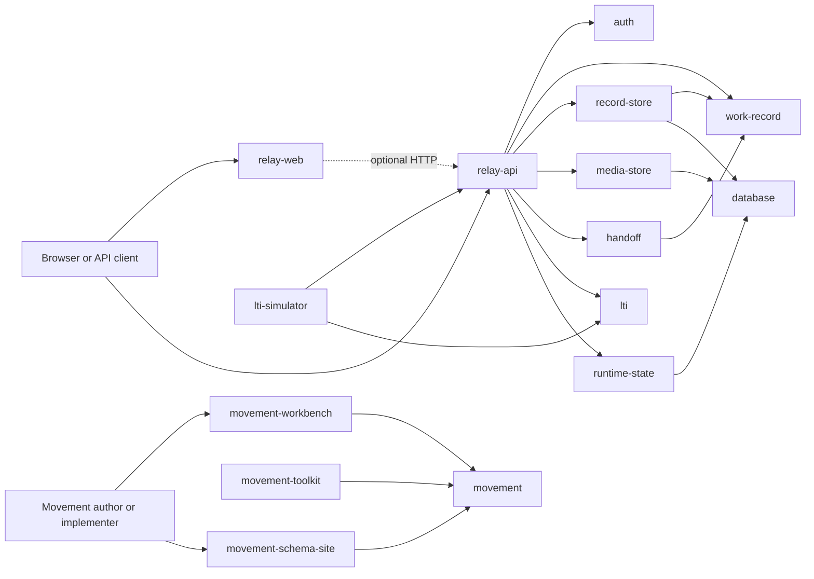
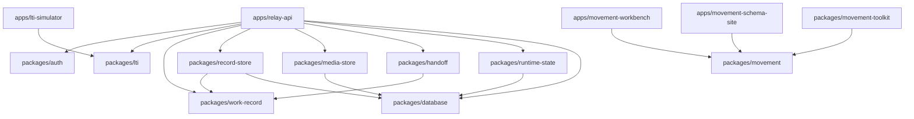

# Architecture

## Purpose and scope

This monorepo holds two related systems:

- **Practice Relay** accepts authenticated WorkRecord operations, applies policy
  and membership rules, persists records and media, and produces
  integrity-checked handoffs or declared-loss projections.
- **MvEI** defines portable movement documents and supplies local authoring,
  reference, validation, import, and engraving surfaces.

A WorkRecord can carry a neutral reference to an MvEI document. The domain
packages do not depend on each other, and Practice Relay and MvEI Workbench are
not one application.

## Components

| Layer | Components | Responsibility |
| --- | --- | --- |
| Delivery | `apps/relay-api`, `apps/relay-web`, `apps/lti-simulator` | HTTP runtime, static browser workspace, local LTI test driver |
| MvEI delivery | `apps/movement-workbench`, `apps/movement-schema-site` | Local movement authoring and reference surfaces |
| Domain | `packages/work-record`, `packages/movement` | Portable WorkRecord and movement contracts |
| Interchange | `packages/handoff`, `packages/movement-toolkit` | Handoff packages, projections, movement import, validation, rendering |
| Adapters | `packages/auth`, `packages/lti`, `packages/media-store`, `packages/record-store`, `packages/runtime-state`, `packages/database` | Identity, protocol, media, persistence, shared login/LTI state, PostgreSQL pooling and migrations |
| Verification | root `scripts/` | Repository-wide checks and docs/demo tooling |

## Dependency direction

Applications depend on packages. Packages never import applications, applications
never import one another, and package cycles are rejected.

`scripts/check-boundaries.mjs` enforces this direction, declared workspace
dependencies, the absence of cycles, and the independence of the WorkRecord and
movement domains. It also rejects Node builtins in the browser-safe `movement`
sources and relative imports that leave their own workspace; the only exceptions
are the dev servers' shared helpers in root `scripts/`.

## Practice Relay request and data flows

### Record operations

1. `apps/relay-api` checks Host and Origin policy before a route reads
   credentials or a request body.
2. Bearer authentication establishes the local account identity.
3. WorkRecord membership determines record access and the domain role for the
   operation. An account's descriptive default role is not authorization.
4. The API bounds and translates input, then calls WorkRecord parsing,
   authorization, and pure transitions.
5. `packages/record-store` validates revisions and writes through the selected
   memory, JSON, or PostgreSQL adapter. PostgreSQL mutations lock the latest
   aggregate and commit the revision and audit event together.
6. The API serializes the result and records process-local metrics and structured
   request events.

The public HTTP registry is
[`apps/relay-api/src/public-routes.ts`](../apps/relay-api/src/public-routes.ts).
[`apps/relay-api/openapi.yaml`](../apps/relay-api/openapi.yaml) is the external
contract, and `pnpm check:contracts` checks their parity.

### Media

The API checks authorization and quotas before writing bytes. It commits media
metadata to the WorkRecord only after storage succeeds, and rolls back the media
write when the record update fails. Downloads require record membership and a
take that names the requested storage key.

Record and media persistence are deliberately separate: `record-store` owns
WorkRecord state, while `media-store` owns filesystem, memory, or S3-compatible
objects.

### Handoffs and projections

`packages/handoff` consumes a validated WorkRecord snapshot. It can create a
manifest, integrity hashes, RO-Crate 1.3 metadata, and a ZIP archive. Its OTIO,
EAF, OSC, and MusicXML-reference paths are projections, not replacement records,
and every projection returns machine-readable losses and omitted fields.

### Local LTI flow

`apps/lti-simulator` drives local registration, OIDC, launch, token, and
AGS-shaped requests through `packages/lti` and the API. OIDC state is bounded,
short-lived, and single-use; PostgreSQL mode coordinates it across processes.
This is a repository test flow, not a Canvas or Moodle deployment and not IMS
certification.

## MvEI flow

`packages/movement` is the only owner of movement schemas, schema identifiers,
vocabulary, glyph contracts, corpus fixtures, and browser-safe transforms. Both
local applications consume that package. `packages/movement-toolkit` builds on it
for Node and CLI validation, intermediate LabanWriter import, reference reading,
capture normalization, and engraving.

Motif and the pedagogical Laban subset are bounded profiles. The repository does
not implement proprietary `.lw` decoding, full professional Labanotation, or a
live capture-hardware pipeline.

## State and configuration ownership

| State | Owner and boundary |
| --- | --- |
| WorkRecord aggregate and revision | `work-record` async contract; `record-store` memory, JSON, or PostgreSQL implementation |
| Record events, audit, and JSON backups | Durable JSON record store |
| Media bytes | `media-store`; not included in record-store backups |
| Authentication users and sessions | Local `auth` service; HMAC bearer sessions |
| LTI keys and pending launches | Runtime-state adapter and local LTI helpers |
| Browser fallback and demo data | Static application; synthetic and no-write |
| Movement documents and corpus | `movement` package contracts and fixtures |
| Store, topology, and readiness environment | `relay-api` runtime configuration; `record-store` receives explicit options |

The API defaults to an in-memory record store unless a store or data directory is
configured. JSON supports single-process labs. PostgreSQL provides shared record
and runtime coordination; multiple processes require it, and missing migrations
fail closed. See [multi-process migration](relay/multi-process.md).
Configuration, readiness, backup scope, and secret handling are documented in
[Practice Relay operations](relay/operations.md).

## Authentication and authorization

Authentication is local HMAC bearer authentication. Strict configured-user mode
requires non-empty user records with versioned scrypt password hashes. Synthetic
identities and development secrets require an explicit local opt-in.

Authorization is domain-owned and record-specific. WorkRecord membership and its
role control access. Descriptive actor roles, account defaults, and a tenant path
prefix do not grant access or establish isolation.

## Build and deployment boundaries

Only `packages/movement`, `packages/movement-toolkit`, and `apps/relay-api` have
compiled build outputs. Packed-consumer checks exercise the two movement
artifacts, but every package remains private in this candidate. The static
applications run directly from source; `apps/relay-web` only stages its files into
`dist/` for GitHub Pages.

The repository ships loopback development servers and single-host Docker Compose
lab examples. It does not ship TLS termination, managed identity, high
availability, managed database infrastructure, backup scheduling, off-host media
recovery, or orchestrator configuration. See [lab deployment](../deploy/README.md).

## Invariants and extension points

- Keep `@practice-relay/*` exports and schema identifiers stable within the
  current alpha baseline unless a reviewed breaking change updates consumers,
  fixtures, and migration notes together.
- WorkRecord validation, membership access, policy, and release decisions fail
  closed.
- A handoff or projection is downstream of the canonical WorkRecord and cannot
  become a second source of truth.
- Unsupported projection information is reported, never silently discarded.
- An adapter capability selects durable behavior; it is not inferred from an
  environment variable or method name.
- New record persistence implementations satisfy the WorkRecord store port and
  belong in `record-store` or an externally injected adapter.
- New movement tools consume `movement`; they do not fork its schemas.
- HTTP statuses for domain and adapter failures come from stable error codes,
  not message text. Roles and command permissions are defined once in
  `work-record`.
- `apps/relay-api` reads process configuration once; packages take explicit
  options or an injected environment object.
- Root `scripts/` holds repository-wide checks and docs/demo tooling only.
  Operational CLIs live with the workspace that owns them.

For subsystem details, read [Practice Relay](relay/README.md) and
[MvEI](movement/README.md).
