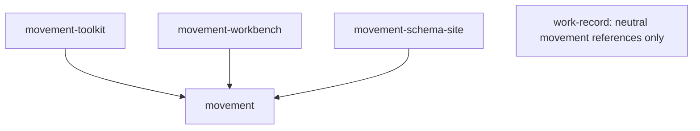

# MvEI architecture

`packages/movement` owns the browser-safe data contracts: JSON schemas,
vocabulary, glyph contracts, corpus fixtures, the browser parser, and domain
transforms. `packages/movement-toolkit` consumes those contracts for Node and
CLI tasks. Workbench and the schema site consume the same package and do not own
competing schemas.

Motif and the pedagogical Laban subset are bounded representations. Intermediate
JSON import for the LabanWriter path is implemented; proprietary `.lw` decoding
is not. Capture normalization and reference reading keep provenance and
validation results, but they do not certify source hardware or create a live
capture pipeline.

The browser entrypoint avoids filesystem access and Node-only validator
dependencies. The toolkit adds Ajv, filesystem, and CLI behavior without changing
schema ownership. Generated vocabulary modules and the TypeScript contract must
match their canonical source; the package build and test scripts run the
generator in check mode.

The `@practice-relay/movement` package paths and current `urn:mvei:*` schema
identifiers form the private-alpha baseline. Historical workspace names and
hostname-based schema identifiers are intentionally not aliased.

See [MvEI](README.md) for the current schema-change review and external
implementer boundary.
