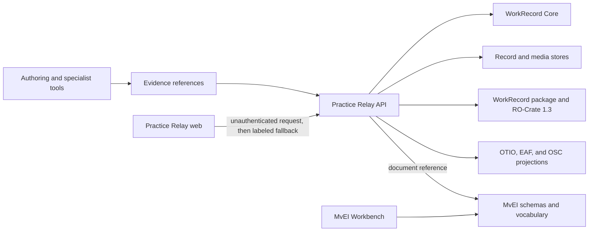

<!-- Current system architecture. Why: records application ownership, shared contracts, and trust boundaries. -->
# Practice Relay and MvEI architecture

Candidate: `0.4.0-alpha.1`.

## Ownership

| Layer | Path | Owns | Does not own |
|---|---|---|---|
| Practice Relay web and API | `practice-relay/apps/web`, `practice-relay/apps/api` | WorkRecord presentation, lifecycle, authorization, media, and handoff export | Specialist authoring, repository retention, campus identity |
| Practice Relay adapters | `practice-relay/apps/lti*`, `practice-relay/packages/*` | Local authentication, stores, collaboration, and LTI mock behavior | IMS certification, production identity, managed availability |
| WorkRecord Core | `packages/work-record-core` | Neutral WorkRecord types, mutation policy, and snapshots | UI, transport, and storage |
| Shared packages | `packages/*` | Time, media index, use policy, packaging, movement contracts, and interop | Product navigation or product merge |
| MvEI | `packages/movement-encode`, `mvei/packages/*`, `mvei/apps/schema-site` | Movement contracts, fixtures, validation, and reference tools | Practice Relay lifecycle or adoption claims |
| MvEI Workbench | `mvei/apps/workbench` | Local MvEI editing and session behavior | Practice Relay record lifecycle |

## Trust boundaries

- The API listener defaults to loopback.
- Development users, configured plaintext passwords, and local LTI are restricted to synthetic evaluation.
- Media retrieval requires WorkRecord authorization.
- Export decisions fail closed when required policy evidence is absent.
- Durable local files depend on host access controls.
- Historical research and release records are not current runtime proof.

Build and verification order is documented in the root [`README.md`](../../README.md). Naming and separation rules are in [`naming.md`](naming.md) and [`merge-decision.md`](merge-decision.md).
