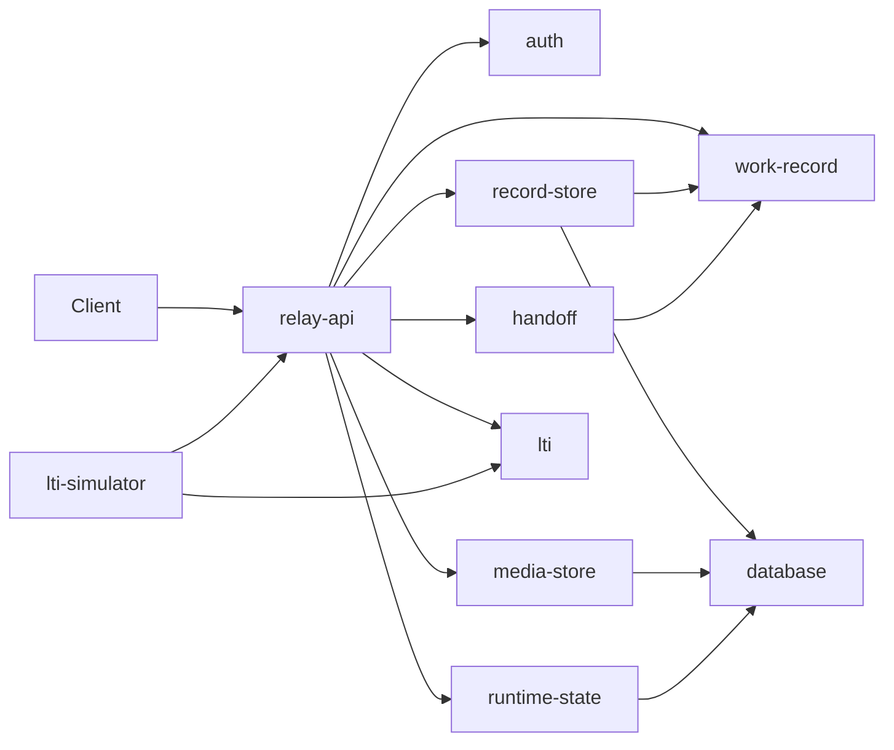

# Practice Relay architecture

`apps/relay-api` is the transport and runtime-composition boundary.
`packages/work-record` owns the canonical aggregate, pure transitions,
membership authorization, time, policy, media-reference semantics, and the
minimal persistence port. Schema-backed parsing is a validation boundary in that
package, not a second domain model.

`packages/record-store` is the only in-tree owner of the WorkRecord store port.
Its memory and JSON adapters share parsing, revision, cloning, event, and audit
semantics while declaring durability explicitly. `packages/media-store` owns
media bytes separately. `packages/handoff` consumes validated snapshots and never
becomes the record of truth.

## Record flow

1. Host and Origin checks run before credentials or request bodies are read.
2. Local bearer authentication establishes the account.
3. WorkRecord membership determines access and the record-specific role.
4. The API bounds input and invokes domain parsing and pure transitions.
5. The record adapter validates the expected revision and persists the result.
6. Responses, structured request logs, and process-local metrics are emitted.

Media writes add WorkRecord metadata only after the byte store succeeds, and roll
back the media write if the record update fails. Reads require both record
membership and a matching take storage key.

The API owns HTTP parsing, process configuration, generated request identities,
and use-case orchestration under `apps/relay-api/src/application`. It must not
define a second record-role model: `actors[].roles` and account `defaultRole` are
descriptive, and empty WorkRecord membership grants no access. Roles
(`ROLES`) and the permission each command requires (`COMMAND_PERMISSIONS`,
`requiredPermission`) come from `work-record`.

Process configuration is read once in `apps/relay-api/src/runtime-config.ts`.
Packages receive explicit options (for example `createRecordStore`); a package
that reads its own variables takes the environment object from the API rather
than parsing a second copy of the same setting.

HTTP statuses for domain and adapter failures come from stable error codes,
never from message text: `WORK_RECORD_INVALID` answers 400,
`WORK_RECORD_ROLE_DENIED` and `WORK_RECORD_POLICY_DENIED` answer 403, and
`WORK_RECORD_DUPLICATE`,
`RECORD_REVISION_CONFLICT`, and `MEDIA_OBJECT_EXISTS` answer 409.
`apps/relay-api/src/request-errors.ts` is the single classifier. Errors are
classified by origin: rule violations (plain `Error` or `RangeError`) thrown by
pure WorkRecord transitions inside a `mutate` callback or by pure export,
projection, and share code, and record-store rejections of a record about to be
written, become `WORK_RECORD_INVALID`. Programming defects such as `TypeError`,
and every other unclassified failure such as a database, filesystem, or
object-store fault, answer 500 with the generic detail `unexpected internal
error`; the cause is logged server-side and never echoed to the client.

Handoff package export and every interoperability projection parse the complete
canonical WorkRecord and require the relevant fail-closed policy decision.
Callers must retain the reported losses and provenance.

The local LTI flow keeps pending OIDC state in `packages/runtime-state`: in
memory for a single process, or in PostgreSQL when processes share coordination.
State is bounded, expires after five minutes, and is consumed once — suitable for
the repository's simulator, not a production identity system.

See the whole-repository [Architecture](../ARCHITECTURE.md) for MvEI and build
boundaries.
