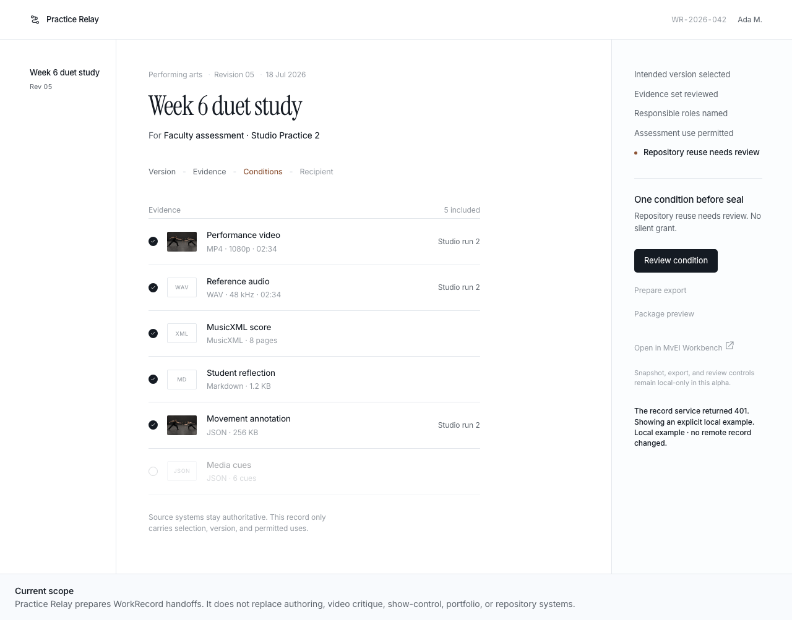

# Practice Relay

Practice Relay is the repository's main application for preparing policy-aware WorkRecord handoffs. It links evidence, revisions, participants, represented subjects, permitted uses, and export decisions while leaving authoring, assessment, portfolio, and repository systems responsible for their own records.

Status: local `0.4.0-alpha.1` source candidate. The configured Git origin is
`https://github.com/sebastianspicker/practice-relay.git`; publication state was
not queried. The browser and API are suitable only for synthetic local
evaluation. See [`../docs/ALPHA.md`](../docs/ALPHA.md) and
[`../RELEASE_STATUS.md`](../RELEASE_STATUS.md).

Practice Relay is separate from MvEI and MvEI Workbench. The applications share contracts but are not one product.



## Implemented surfaces

| Layer | Path | Current capability |
|---|---|---|
| Domain | `packages/work-record-core` | WorkRecord lifecycle, roles, comments, snapshots, represented subjects, use decisions, and MvEI references |
| Store | `practice-relay/packages/record-store` | In-memory and durable JSON record adapters, audit events, backup, and restore |
| Media | `practice-relay/packages/media-store` | Local and S3-compatible media boundaries with authorization checks |
| Authentication | `practice-relay/packages/auth` | Synthetic development identities and configured-user loading |
| Export | `packages/work-record-package` | Manifest validation and RO-Crate 1.3 package output |
| API | `practice-relay/apps/api` | HTTP record, media, export, operations, and local LTI routes |
| Web | `practice-relay/apps/web` | WorkRecord presentation with loading, empty, error, and labeled synthetic fallback states |
| LTI | `practice-relay/apps/lti`, `practice-relay/apps/lti-mock-platform` | Local mock platform and launch paths, not IMS certification |
| Acceptance | `tests/acceptance` | Product-boundary and residual checks |

The web shell has no browser sign-in flow. It therefore cannot load the authenticated API collection in the default setup and shows a synthetic local record after the request is rejected. Its snapshot and export buttons update local status only.

## Run locally

From the repository root:

```bash
pnpm install --frozen-lockfile
pnpm --filter @practice-relay/web dev
```

Open `http://127.0.0.1:5173/`.

Start the API in another terminal when testing its HTTP surface:

```bash
PRACTICE_RELAY_ALLOW_SYNTHETIC_AUTH=1 pnpm --filter @practice-relay/api start
```

The API binds to `127.0.0.1:8787` by default. Direct use of the synthetic users
and development signing secret requires `PRACTICE_RELAY_ALLOW_SYNTHETIC_AUTH=1`.
Non-loopback binding requires strict secrets and configured users. Development
users and configured plaintext passwords must not be used with real participant
credentials. Browser CORS is denied by default. Configure exact trusted origins
only when an authenticated browser client exists.

## Validation

```bash
pnpm --filter @practice-relay/work-record-core test
pnpm --filter @practice-relay/api test
pnpm --filter @practice-relay/interop test
pnpm --filter @practice-relay/use-policy test
pnpm test
```

## Documentation

- [`IMPLEMENTATION.md`](IMPLEMENTATION.md): current implementation map
- [`docs/ops.md`](docs/ops.md): local storage, secrets, backup, and restore
- [`docs/package-vs-video.md`](docs/package-vs-video.md): package and video boundary
- [`docs/lms-registration-preflight.md`](docs/lms-registration-preflight.md): external LMS preflight, not a delivered integration
- [`docs/acceptance-criteria.md`](docs/acceptance-criteria.md): acceptance checks
- [`../docs/EVIDENCE.md`](../docs/EVIDENCE.md): implementation evidence and claim limits

## Current limitations

- No authenticated browser session flow
- No production identity provider integration
- Plaintext configured-password format, restricted to synthetic local evaluation
- Local mock LTI only
- Postgres adapter is an explicit fail-closed stub
- No production deployment or multi-site pilot claim
